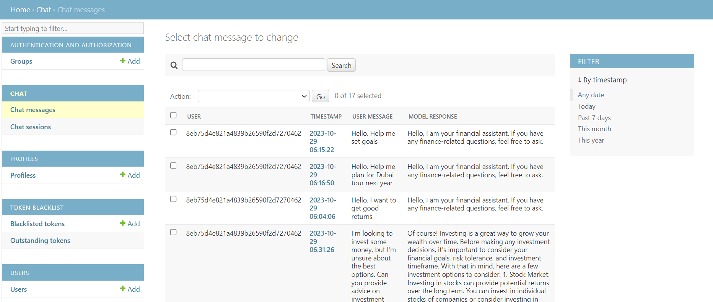
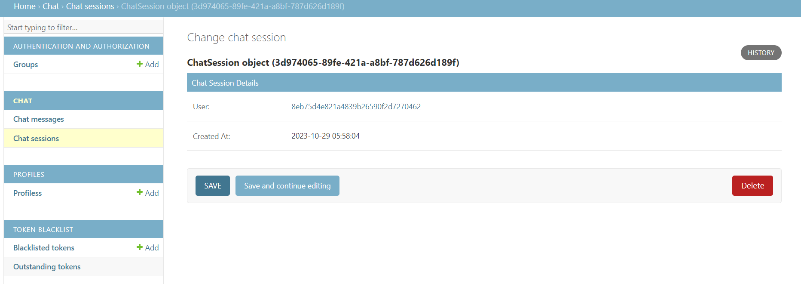
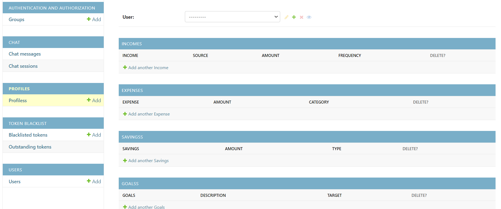

# A2svHackathon

## Description

A2svHackathon is an AI financial literacy platform designed to facilitate learning about financial literacy and entrepreneurship.

## Backend

### Technologies

The project is created with:

- Python Django
- Django RestFramework
- drf_yasg (swagger) -- for endpoint documentation

### Installation

1. **Prerequisites:**
   - Make sure Python 3.8.10 is installed.

     ```bash
     python --version  # Should be Python 3.8.10
     ```

2. **Clone the Repository:**
   - Using SSH:

     ```bash
     git clone git@github.com:EdwinAtieno/A2svHackathon.git
     ```

   - Using HTTP:

     ```bash
     git clone https://github.com/EdwinAtieno/A2svHackathon.git
     ```

   - Navigate to the cloned folder:

     ```bash
     cd A2svHackathon
     ```

3. **Install Requirements:**
   ```bash
   make requirements  # or python3 manage.py install -r requirements.txt || pipenv install --dev
   ```


### Environment Variables

| Variable         | Description                                                                                                                      | Default          |
| ---------------- | -------------------------------------------------------------------------------------------------------------------------------- | ---------------- |
| **SECRET_KEY**   | **Required** - String of random characters used for cryptographic signing in [Django](https://docs.djangoproject.com/en/2.1/ref/settings/#std:setting-SECRET_KEY) projects.                  | -                |
| **DB_NAME**      | **Required** - Represents the name of the database.                                                                               | -                |
| **ENVIRONMENT**  | *Optional* - Used to load different settings based on the environment selected. Choices: `production`, `development`, `common`.  | `development`    |
| **DB_USER**      | **Required** - Represents the database username.                                                                                 | -                |
| **DB_PASSWORD**  | **Required** - Database password.                                                                                                | -                |
| **DB_HOST**      | **Required** - Database host.                                                                                                   | -                |


### Usage

- Clone the repository:
  - Using SSH:

     ```bash
     cd A2svHackathon
     ```

  - Using Http:

    ```tet
    git clone https://github.com/EdwinAtieno/A2svHackathon.git
    ```

- Navigate to the cloned folder:

     ```bash     cd A2svHackathon
     ```

-   Pre-commit hook

     ```bash
     pre-commit install
     ```

- Create a virtual environment.

     ```bash
     python3 -m venv venv

     Or Install virtualenv then
     virtualenv venv

     On Linux ~ source venv/bin/activate

     On windows ~ venv\Scripts\Activate

     Or run pipenv shell
    ```

- Configuring postgres Ubuntu

    ```bash
    Update: sudo apt update
    
    Installing: sudo apt install python3-pip python3-dev libpq-dev postgresql postgresql-contrib
    
    First login by running: sudo -u postgres psql
    
    Create DB: CREATE DATABASE A2svHackathon;
    
    Create USER: CREATE USER A2svHackathon WITH PASSWORD 'A2svHackathon@';
    
    run: \q to exit server
    ``` 

- Run migrations.

     ```bash
     make migrations ~ python manage.py makemigrations

     make migrate ~ python manage.py migrate
     ```

- Create a super user.

     ```bash
     python manage.py createsuperuser
     ```

- Run the app.

     ```bash
     make serve ~ python manage.py runserver
     ```

- This opens the app at {{BASE_URL}}

     ```bash
     localhost:8000
     ```

- or

     ```bash
     http://127.0.0.1:8000/

     ```

## Implemented Endpoints

- **Authentication:**
  - Sign-in: [POST] [http://localhost:8000/api/sign-in/](http://localhost:8000/api/sign-in/)

- **User Management:**
  - List of Users: [GET] [http://127.0.0.1:8000/api/users/](http://127.0.0.1:8000/api/users/)

- **Chat Service:**
  - Prompting: [POST] [http://127.0.0.1:8000/api/chat-messages/](http://127.0.0.1:8000/api/chat-messages/)
    - **Sample Request:**
      ```json
      {
        "user_message": "I'm looking to invest some money, but I'm unsure about the best options. Can you provide advice on investment strategies and potential opportunities for good returns?"
      }
      ```
    - **Sample Response:**
      ```json
      {
        "id": "867e14ff-ccde-4c66-a278-b5b3dcfeac64",
        "timestamp": "2023-10-29T10:02:20.008047+03:00",
        "user_message": "I'm looking to invest some money, but I'm unsure about the best options. Can you provide advice on investment strategies and potential opportunities for good returns?",
        "model_response": "Certainly! Investing is a great way to grow your wealth over time. Before diving into specific investment options, it's important to consider your financial goals, risk tolerance, and investment timeframe.\n\nHere are some investment strategies and potential opportunities for good returns in Kenya:\n\n1. Stock Market: Investing in stocks can provide attractive returns over the long term. Consider investing in well-established companies with a track record of consistent growth and strong fundamentals. It's advisable to diversify your investment across different sectors to minimize risk.\n\n2. Mutual Funds: Mutual funds pool money from multiple investors to invest in a diversified portfolio of stocks, bonds, or other assets. They are managed by professionals and offer a relatively low-cost way to access a diversified investment portfolio.\n\n3. Real Estate: Investing in real estate can be a lucrative long-term investment option. Consider investing in residential or commercial properties, land, or real estate investment trusts (REITs). Rental income and property appreciation can provide good returns.\n\n4. Government Bonds: Government bonds are considered low-risk investments as they are backed by the government. They offer fixed interest payments over a specified period of time and can be a good option for conservative investors.\n\n5. Peer-to-Peer Lending: This involves lending money directly to individuals or small businesses through online platforms. It offers potentially higher returns compared to traditional savings accounts, but it's important to assess the creditworthiness of borrowers and diversify your lending across multiple borrowers.\n\n6. Unit Trusts: Similar to mutual funds, unit trusts pool money from multiple investors to invest in a diversified portfolio of assets. They are managed by professional fund managers and offer a range of investment options based on your risk appetite and investment goals.\n\nRemember, it's crucial to conduct thorough research, seek advice from financial professionals, and diversify your investments to manage risk effectively. Additionally, regularly review and rebalance your portfolio to ensure it aligns with your changing financial goals and market conditions.\n\nPlease note that investment returns are subject to market fluctuations, and past performance is not indicative of future results. It's essential to consider your personal financial situation and consult with a financial advisor before making any investment decisions.",
        "role": "user",
        "user": "8eb75d4e821a4839b26590f2d7270462",
        "session": "3d974065-89fe-421a-a8bf-787d626d189f"
      }
      ```

- **Sessions:**
  - Create Session: [POST] [http://127.0.0.1:8000/api/chat-sessions/](http://127.0.0.1:8000/api/chat-sessions/)
  - **Sample Request:**
      ```json
      {
        "user": "8eb75d4e821a4839b26590f2d7270462"
      }
      ```

  - **Sample Response:**
      ```json
      {
        "id": "3d974065-89fe-421a-a8bf-787d626d189f",
        "conversation_history": [
            "Hello. What is saving?. I want to achieve financial freedom",
            "Hello! Saving refers to the act of setting aside a portion of your income or funds for future use or to achieve specific financial goals. It is an essential component of achieving financial freedom. Financial freedom generally refers to a state where you have enough savings and investments to cover your expenses and maintain your desired lifestyle without relying on a regular paycheck.\n\nTo achieve financial freedom through saving, here are a few recommendations:\n\n1. Set clear financial goals: Define your objectives, such as saving for retirement, purchasing a home, or starting a business. This will help you understand how much you need to save and for how long.\n\n2. Create a budget: Track your income and expenses to identify areas where you can cut back and save more. Allocate a portion of your income specifically for savings.\n\n3. Automate your savings: Set up automatic transfers from your paycheck or checking account to a separate savings account. This way, you'll be less tempted to spend the money before saving it.\n\n4. Prioritize emergency savings: Build an emergency fund that can cover at least three to six months' worth of living expenses. It will provide a safety net in case of unexpected events or emergencies.\n\n5. Explore different saving options: Consider various savings vehicles like high-yield savings accounts, fixed deposits, or money market funds. Each option has different risk levels and potential returns, so choose based on your risk tolerance and time horizon.\n\n6. Control impulse spending: Differentiate between needs and wants. Avoid unnecessary expenses and impulse purchases that can derail your savings goals.\n\n7. Review and adjust regularly: Periodically review your savings progress and adjust your strategy if needed. Life circumstances and financial goals may change, requiring adjustments to your savings plan.\n\nRemember, achieving financial freedom is a long-term journey. It requires discipline, consistency, and patience. Consider working with a financial advisor who can provide personalized advice based on your specific financial situation.",
            "Hello. I want to get good returns",
            "Hello, I am your financial assistant. If you have any finance-related questions, feel free to ask.",
            "Hello. I want to get good returns on my investments",
            "Hello! That's great to hear that you are interested in getting good returns on your investments. To provide you with tailored recommendations, I'll need some more information. Could you please share the following details:\n\n1. Investment Horizon: How long are you planning to invest for? Are you looking for short-term or long-term investments?\n\n2. Risk Tolerance: How comfortable are you with taking risks? Are you willing to accept higher market volatility in exchange for potentially higher returns, or do you prefer more stable and conservative investments?\n\n3. Investment Amount: How much are you planning to invest? This will help determine the investment options available to you.\n\n4. Investment Knowledge: How familiar are you with different investment vehicles such as stocks, bonds, mutual funds, real estate, etc.? This will help me tailor my recommendations to your level of understanding.\n\nPlease provide these details, and I'll be able to provide you with personalized advice on how to achieve good returns on your investments.",
            "Hello. Help me set goals",
            "Hello, I am your financial assistant. If you have any finance-related questions, feel free to ask.",
            "Hello. What financial goals can i set for next year? I want to visit Dubai",
            "Hello, I am your financial assistant. If you have any finance-related questions, feel free to ask.",
            "Hello. What financial goals can i set for next year? I want to visit Dubai",
            "Hello, I am your financial assistant. If you have any finance-related questions, feel free to ask.",
            "Hello. Help me plan for Dubai tour next year",
            "Hello, I am your financial assistant. If you have any finance-related questions, feel free to ask.",
            "Hello. Help me plan for Dubai tour next year",
            "Of course, I'd be happy to help you plan for your Dubai tour next year. Planning ahead is a great way to ensure a smooth and financially sound trip. Here are a few steps you can take to start your planning process:\n\n1. Set a Budget: Determine how much you are willing to spend on your trip to Dubai. Consider expenses such as flights, accommodation, transportation, food, activities, and souvenirs. Having a budget in mind will help you make informed decisions throughout the planning process.\n\n2. Research and Compare Flights: Start researching flight options well in advance to secure the best deals. Use flight comparison websites to compare prices and consider booking during off-peak seasons or on weekdays to save money.\n\n3. Choose Accommodation Wisely: Look for accommodation options that fit your budget and preferences. Dubai offers a wide range of hotels, apartments, and guesthouses. Consider factors such as location, amenities, and reviews when making your decision.\n\n4. Plan Activities and Attractions: Dubai has numerous attractions and activities to offer. Research and make a list of the places you would like to visit, such as the Burj Khalifa, Dubai Mall, Palm Jumeirah, and Desert Safari. Look for discounted tickets or packages that include multiple attractions to save money.\n\n5. Save Money on Transportation: Dubai has an efficient public transportation system, including the metro, buses, and taxis. Consider using public transportation whenever possible to save on transportation costs. Additionally, you may want to research transportation passes or cards that offer discounted fares.\n\n6. Consider Travel Insurance: It's always a good idea to have travel insurance to protect yourself against unexpected events such as flight cancellations, medical emergencies, or lost luggage. Compare different insurance options to find one that suits your needs.\n\n7. Stay Updated on Travel Advisories: Keep an eye on travel advisories and guidelines for Dubai to ensure you are aware of any safety concerns or entry requirements. Stay informed about visa requirements, COVID-19 protocols, and any other relevant information.\n\nRemember, it's important to plan ahead and make informed choices to optimize your Dubai tour. If you have any specific questions or goals in mind, feel free to share, and I'll provide personalized assistance.",
            "Hello. Help me plan for Dubai tour next year. How much should I save?",
            "Hello, I am your financial assistant. If you have any finance-related questions, feel free to ask.",
            "Hello. Help me plan for Dubai tour next year. How much should I save?",
            "Hello, I am your financial assistant. If you have any finance-related questions, feel free to ask.",
            "Hello. Help me plan for Dubai tour next year. How much should I save?",
            "Hello, I am your financial assistant. If you have any finance-related questions, feel free to ask.",
            "Hello. Help me plan for Dubai tour next year.",
            "Hello, I am your financial assistant. If you have any finance-related questions, feel free to ask.",
            "Hello. Tell me about banking.",
            "Hello, I am your financial assistant. If you have any finance-related questions, feel free to ask.",
            "I'm looking to invest some money, but I'm unsure about the best options. Can you provide advice on investment strategies and potential opportunities for good returns?",
            "Certainly! Investing your money can be a great way to grow your wealth over time. It's important to consider your financial goals, risk tolerance, and timeline before deciding on an investment strategy. Here are a few investment options you can consider:\n\n1. Stocks: Investing in individual stocks can offer the potential for high returns, but it also comes with higher risk. It's important to research and choose stocks of companies with strong fundamentals and growth potential.\n\n2. Mutual Funds: Mutual funds pool money from multiple investors to invest in a diversified portfolio of stocks, bonds, or other securities. They are managed by professionals, making them a suitable option for beginners who want diversification and professional management.\n\n3. Exchange-Traded Funds (ETFs): ETFs are similar to mutual funds, but they trade on stock exchanges like individual stocks. They offer diversification and can be a cost-effective way to invest in a broad market index or a specific sector.\n\n4. Bonds: Bonds are fixed-income securities where you lend money to governments or corporations in exchange for regular interest payments. They are generally considered less risky than stocks and can provide a steady income stream.\n\n5. Real Estate: Investing in real estate can provide both rental income and potential appreciation. You can invest directly in properties or consider real estate investment trusts (REITs) that allow you to invest in a portfolio of properties.\n\n6. Diversification: It's important to diversify your investments across different asset classes to spread the risk. This can help protect your portfolio from the impact of a single investment.\n\nRemember, it's essential to do thorough research, consider your risk tolerance, and consult with a financial advisor before making any investment decisions. They can provide personalized advice based on your specific financial situation and goals.",
            "I'm looking to invest some money, but I'm unsure about the best options. Can you provide advice on investment strategies and potential opportunities for good returns?",
            "Of course! Investing is a great way to grow your wealth over time. Before making any investment decisions, it's important to consider your financial goals, risk tolerance, and investment timeframe. With that in mind, here are a few investment options to consider:\n\n1. Stock Market: Investing in stocks can provide potential returns over the long term. You can invest in individual stocks of companies or consider investing in Exchange-Traded Funds (ETFs) that offer diversification across multiple stocks.\n\n2. Mutual Funds: Mutual funds pool money from multiple investors to invest in a diversified portfolio of stocks, bonds, or other assets. They are managed by professional fund managers and are suitable for investors who prefer a hands-off approach.\n\n3. Bonds: Bonds are fixed-income securities where you lend money to governments or corporations in exchange for periodic interest payments and the return of the principal amount at maturity. Bonds are generally considered lower risk compared to stocks.\n\n4. Real Estate: Investing in real estate can be a good long-term investment strategy. You can consider buying rental properties, real estate investment trusts (REITs), or investing in real estate crowdfunding platforms.\n\n5. Index Funds: Index funds are passively managed funds that aim to replicate the performance of a specific market index. They offer broad market exposure and have lower fees compared to actively managed funds.\n\n6. Diversification: It's important to diversify your investment portfolio by spreading your investments across different asset classes, sectors, and geographic regions. This helps reduce the overall risk of your portfolio.\n\nRemember, investing involves risks, and it's important to do thorough research or consult with a financial advisor before making any investment decisions. Additionally, consider your investment horizon, liquidity needs, and any potential tax implications.",
            "I'm looking to invest some money, but I'm unsure about the best options. Can you provide advice on investment strategies and potential opportunities for good returns?",
            "Of course! Investing can be a great way to grow your wealth over time. However, it's essential to consider your financial goals, risk tolerance, and investment horizon before making any investment decisions. Here are a few investment strategies and potential opportunities to consider:\n\n1. Diversify Your Portfolio: One of the key principles of investing is diversification. By spreading your investments across different asset classes like stocks, bonds, real estate, and commodities, you can reduce the risk associated with any single investment.\n\n2. Mutual Funds: Mutual funds pool money from multiple investors to invest in a diversified portfolio of stocks, bonds, or other securities. They offer professional management and can be a good option for investors looking for diversification and convenience.\n\n3. Stocks: Investing in individual stocks can provide higher returns but comes with higher risks. It's important to conduct thorough research or seek professional advice before investing in individual stocks.\n\n4. Bonds: Bonds are considered less risky than stocks and can provide a steady income stream. They are debt instruments issued by governments or corporations. Government bonds are generally safer than corporate bonds but offer lower returns.\n\n5. Real Estate: Investing in real estate can provide both income and potential capital appreciation. You can invest in rental properties, real estate investment trusts (REITs), or real estate crowdfunding platforms.\n\n6. Exchange-Traded Funds (ETFs): ETFs are similar to mutual funds but trade on stock exchanges like individual stocks. They offer diversification and can be a cost-effective way to invest in a specific sector, index, or asset class.\n\n7. Peer-to-Peer Lending: Peer-to-peer lending platforms allow you to lend money to individuals or small businesses in exchange for interest payments. It can be an alternative investment option that provides regular income.\n\nRemember, before investing, it's crucial to assess your risk tolerance, consult with a financial advisor, and carefully evaluate the investment options available to you. Additionally, stay updated with market trends and economic conditions that may impact your investments.",
            "I'm looking to invest some money, but I'm unsure about the best options. Can you provide advice on investment strategies and potential opportunities for good returns?",
            "Certainly! Investing is a great way to grow your wealth over time. Before diving into specific investment options, it's important to consider your financial goals, risk tolerance, and investment timeframe.\n\nHere are some investment strategies and potential opportunities for good returns in Kenya:\n\n1. Stock Market: Investing in stocks can provide attractive returns over the long term. Consider investing in well-established companies with a track record of consistent growth and strong fundamentals. It's advisable to diversify your investment across different sectors to minimize risk.\n\n2. Mutual Funds: Mutual funds pool money from multiple investors to invest in a diversified portfolio of stocks, bonds, or other assets. They are managed by professionals and offer a relatively low-cost way to access a diversified investment portfolio.\n\n3. Real Estate: Investing in real estate can be a lucrative long-term investment option. Consider investing in residential or commercial properties, land, or real estate investment trusts (REITs). Rental income and property appreciation can provide good returns.\n\n4. Government Bonds: Government bonds are considered low-risk investments as they are backed by the government. They offer fixed interest payments over a specified period of time and can be a good option for conservative investors.\n\n5. Peer-to-Peer Lending: This involves lending money directly to individuals or small businesses through online platforms. It offers potentially higher returns compared to traditional savings accounts, but it's important to assess the creditworthiness of borrowers and diversify your lending across multiple borrowers.\n\n6. Unit Trusts: Similar to mutual funds, unit trusts pool money from multiple investors to invest in a diversified portfolio of assets. They are managed by professional fund managers and offer a range of investment options based on your risk appetite and investment goals.\n\nRemember, it's crucial to conduct thorough research, seek advice from financial professionals, and diversify your investments to manage risk effectively. Additionally, regularly review and rebalance your portfolio to ensure it aligns with your changing financial goals and market conditions.\n\nPlease note that investment returns are subject to market fluctuations, and past performance is not indicative of future results. It's essential to consider your personal financial situation and consult with a financial advisor before making any investment decisions.",
            "I'm looking to invest some money, but I'm unsure about the best options. Can you provide advice on investment strategies and potential opportunities for good returns?",
            "Of course! Investing is a great way to grow your wealth over time. Before diving into investment options, it's important to consider your financial goals, risk tolerance, and investment time horizon. Here are a few investment strategies and opportunities you can consider:\n\n1. Diversify your portfolio: Spreading your investments across different asset classes such as stocks, bonds, real estate, and commodities can help reduce risk. Consider investing in a mix of low-risk and high-risk assets based on your risk tolerance.\n\n2. Mutual funds: Mutual funds pool money from multiple investors to invest in a diversified portfolio of stocks, bonds, or other securities. They are managed by professionals, making it a suitable option for investors with limited knowledge or time. Evaluate the fund's historical performance, fees, and the fund manager's track record before investing.\n\n3. Stocks: Investing in individual stocks can provide potentially higher returns but also carries higher risk. Research and choose companies with strong fundamentals, growth potential, and a good track record. Consider investing in sectors that align with your interests and expertise.\n\n4. Bonds: Bonds are considered less risky compared to stocks and can provide a steady income stream. Government and corporate bonds offer fixed interest payments over a specified period. Evaluate the issuer's creditworthiness and the bond's maturity period before investing.\n\n5. Real estate: Investing in real estate can be a good long-term investment strategy. You can consider purchasing rental properties or investing in Real Estate Investment Trusts (REITs) that allow you to invest in a diversified portfolio of real estate properties.\n\n6. Exchange-Traded Funds (ETFs): ETFs are similar to mutual funds but trade on stock exchanges like individual stocks. They offer diversification and can track specific market indexes or sectors. Research the ETF's performance, expense ratio, and liquidity before investing.\n\n7. Consult with a financial advisor: If you have a significant amount to invest or are unsure about the best options, it's wise to consult with a financial advisor. They can assess your financial situation, goals, and risk tolerance to provide personalized investment advice.\n\nRemember, investing involves risks, and it's important to do thorough research, diversify your portfolio, and regularly review your investments.",
            "Hello",
            "Hello, I am your financial assistant. If you have any finance-related questions, feel free to ask.",
            "I'm looking to invest some money, but I'm unsure about the best options. Can you provide advice on investment strategies and potential opportunities for good returns?",
            "Of course! I'd be happy to provide some advice on investment strategies and potential opportunities for good returns. However, it's important to note that investment decisions should be based on your individual financial goals, risk tolerance, and time horizon. With that in mind, here are a few investment options you may consider:\n\n1. Stocks: Investing in individual stocks can potentially provide high returns, but it also carries higher risks. It's important to research and analyze the company's financials, industry trends, and management before investing.\n\n2. Bonds: Bonds are considered less risky compared to stocks. They provide a fixed income stream over a specific period. Government bonds are generally considered the safest, but corporate bonds may offer higher yields.\n\n3. Mutual Funds: Mutual funds pool money from multiple investors to invest in a diversified portfolio of stocks, bonds, or other assets. They offer professional management and diversification, making them suitable for beginners.\n\n4. Real Estate: Real estate investment can generate income through rental properties or appreciation in property value. It's a long-term investment that requires careful research and understanding of the market.\n\n5. Exchange-Traded Funds (ETFs): ETFs are similar to mutual funds but trade on stock exchanges. They offer diversification and are often less expensive than mutual funds.\n\n6. Retirement Accounts: Contributing to a retirement account, such as an Individual Retirement Account (IRA) or an employer-sponsored 401(k), provides tax advantages and is a smart long-term investment strategy.\n\n7. Diversification: It's important to diversify your investments across different asset classes and sectors. This helps spread the risk and reduces the impact of any single investment's performance on your overall portfolio.\n\nRemember, before making any investment decision, it's crucial to do thorough research, understand the associated risks, and consider seeking advice from a qualified financial advisor. They can provide personalized recommendations based on your specific financial situation and goals.",
            "Hello GPT",
            "Hello, I am your financial assistant. If you have any finance-related questions, feel free to ask."
        ],
        "created_at": "2023-10-29T08:58:04.357366+03:00",
        "last_activity": "2023-10-30T12:32:28.636430+03:00",
        "user": "8eb75d4e821a4839b26590f2d7270462"
      }
      ```

- **Profile Management:**
  - Profile List: [GET] [http://localhost:8000/api/profile/](http://localhost:8000/api/profile/)
  - Profile Detail: [GET] [http://localhost:8000/api/profile/<profile_id>/](http://localhost:8000/api/profile/<profile_id>/)

- **Financial Data:**
  - Income List: [GET] [http://localhost:8000/api/income/](http://localhost:8000/api/income/)
  - Income Detail: [GET] [http://localhost:8000/api/income/<income_id>/](http://localhost:8000/api/income/<income_id>/)
  - Expense List: [GET] [http://localhost:8000/api/expense/](http://localhost:8000/api/expense/)
  - Expense Detail: [GET] [http://localhost:8000/api/expense/<expense_id>/](http://localhost:8000/api/expense/<expense_id>/)
  - Savings List: [GET] [http://localhost:8000/api/savings/](http://localhost:8000/api/savings/)
  - Savings Detail: [GET] [http://localhost:8000/api/savings/<savings_id>/](http://localhost:8000/api/savings/<savings_id>/)
  - Goals List: [GET] [http://localhost:8000/api/goals/](http://localhost:8000/api/goals/)
  - Goals Detail: [GET] [http://localhost:8000/api/goals/<goals_id>/](http://localhost:8000/api/goals/<goals_id>/)

------

- Detailed View:
  - http://127.0.0.1:8000/docs/swagger/ 


### Admin Section
- Persisted Chats


- User Sessions


- User Profile Information
 

**_DEVELOPERS_**
- Team Octatech